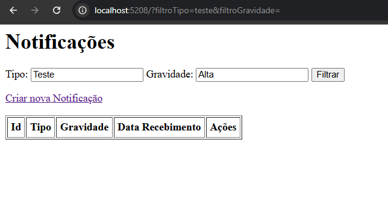
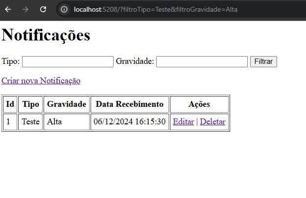

# Sistema de Gerenciamento de Notificações

Este projeto é um sistema simples de gerenciamento de notificações desenvolvido em ASP.NET Core MVC. Ele permite listar e filtrar notificações de acordo com critérios específicos, como tipo e gravidade. Foi realizada uma tentativa de implementação de persistência de dados utilizando SQLite com o Entity Framework Core, mas no momento, apenas a funcionalidade de listagem e filtragem está funcionando.

# Objetivos do Sistema
O sistema foi projetado para:

- Listar notificações: Apresentar todas as notificações armazenadas.
- Filtrar notificações: Permitir a filtragem das notificações com base no tipo e gravidade.
- CRUD de notificações:
- Criar novas notificações.
- Editar notificações existentes.
- Excluir notificações indesejadas.

# Estrutura do Projeto

O projeto segue o padrão Model-View-Controller (MVC) e está organizado da seguinte forma:

```
NotificacoesApp/
│
├── Controllers/
│   └── NotificacaoController.cs       # Controlador principal para as notificações
│
├── Models/
│   ├── AppDbContext.cs                # DbContext para integração com o banco de dados SQLite
│   └── Notificacao.cs                 # Modelo que define a entidade Notificação
│
├── Views/
│   └── Notificacao/
│       ├── Index.cshtml               # Tela de listagem de notificações
│       ├── Create.cshtml              # Tela para criação de notificações
│       ├── Edit.cshtml                # Tela para edição de notificações
│       └── Delete.cshtml              # Tela para confirmação de exclusão
│
├── Migrations/
│   └── (Vazia ou com arquivos gerados pelo Entity Framework)
│
└── Program.cs                         # Configuração do aplicativo e do Entity Framework
```
# Funcionalidades Propostas

## 1) Listagem de Notificações

- Lista todas as notificações cadastradas.
- Utiliza dados armazenados no banco de dados (tentativa de SQLite).

## 2) Filtragem de Notificações

- Filtra notificações por tipo e gravidade.
- Essa funcionalidade está funcionando corretamente.

## 3) Criação, Edição e Exclusão

- Foram implementadas as operações de criação, edição e exclusão de notificações, mas estas não estão persistindo os dados no banco de dados SQLite no momento.

## Classe Notificacao

A classe Notificacao representa o modelo principal do sistema:

```
public class Notificacao
{
    public int Id { get; set; } // Chave primária
    public string Tipo { get; set; } = string.Empty; // Tipo da notificação (ex: Erro, Aviso)
    public string Gravidade { get; set; } = string.Empty; // Gravidade (ex: Alta, Média, Baixa)
    public DateTime DataRecebimento { get; set; } // Data de recebimento da notificação
}
```

## Tentativa de Implementação do SQLite

A persistência dos dados foi planejada para ser realizada utilizando SQLite com o Entity Framework Core. Aqui está um resumo do que foi configurado:

### ``DbContext`` Configurado:

Foi criado o arquivo ``AppDbContext.cs``, que define a tabela Notificacoes

```
public DbSet<Notificacao> Notificacoes { get; set; }
```

### Configuração no ``Program.cs:``

O Banco de dados foi configurado com:

``
builder.Services.AddDbContext<AppDbContext>(options =>
    options.UseSqlite("Data Source=notificacoes.db"));
``

### Migrations Criadas:

As migrations foram geradas para criar a tabela no banco:

```
dotnet ef migrations add InitialCreate
dotnet ef database update
```

### Problema Atual:

Embora o banco de dados tenha sido criado, os registros não estão sendo persistidos ao criar, editar ou excluir notificações. 

# Como Rodar o Projeto

- Certifique-se de que você possui o .NET SDK instalado.
- Navegue até a pasta do projeto e execute:

``
dotnet run
``

- Acesse o sistema pela URL:

``
http://localhost:5208/Notificacao
``

# Funcionalidade Atual
Atualmente, a única funcionalidade totalmente funcional é a filtragem de notificações na tela principal (Index). Conforme mostrado abaixo:




